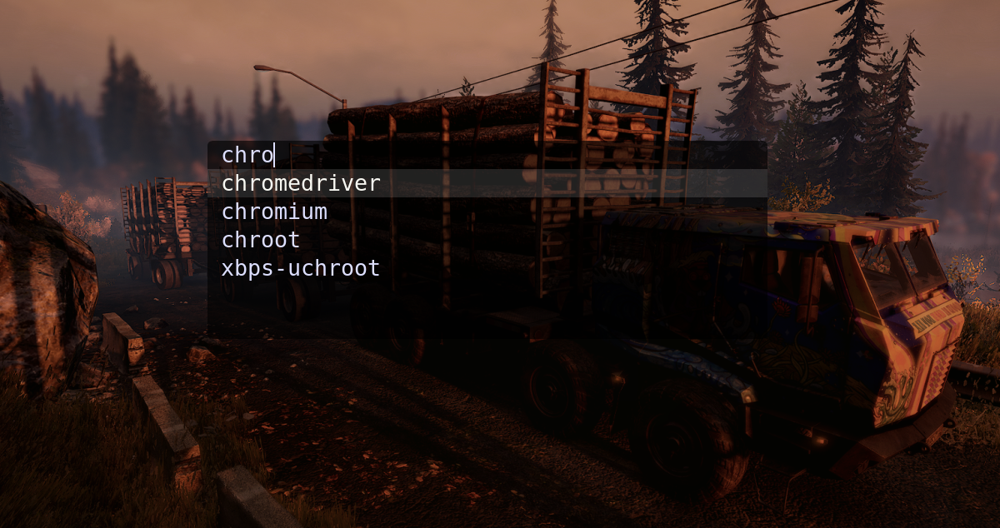

# Dmenu

### This is a fork of the suckless Dmenu, with additional patches and Emoji compatibility.

# ALPHA_B build of Dmenu - dynamic menu for X.



The [suckless dynamic menu (Dmenu)](https://tools.suckless.org/dmenu) with some additional
features that make it literally the best dynamic menu in the Void:

## Bindings for:

You must setup your window manager to allow key binding to launch Dmenu.
and use it to launch Dmenu and look for any installed software on the computer.

## Pretty stuff:

The center or grid location and the alpha patch, which further enhances its appeal, are two features that distinguish this build of Dmenu.

## Patches:

+ Alpha
+ Center
+ Dracula
+ Grid
+ Grid Nav

## Installation:

You should have xlib header and harfbuzz-devel files and noto-fonts-emoji installed.

```
git clone https://github.com/elbachir-one/dmenu
cd dmenu
make
sudo make clean install

```

`make` and `fontconfig` is required to build this.

## Dependences:

### Void Linux:

```
sudo xbps-install -S xorg base-devel libXft-devel libX11-devel libXinerama-devel\
harfbuzz-devel noto-fonts-emoji libXrender-devel
```

### Arch Linux:

```
sudo pacman -Sy xorg base-devel noto-fonts-emoji harfbuzz libxrender
```

### Debian/Ubuntu:

```
sudo apt install build-essential libx11-dev libxinerama-dev suckless-tools libxft-dev
```

### FreeBSD:

```
doas pkg install pkgconfig noto-fonts-emoji
```

### OpenBSD:

```
doas pkg_add pkgocnfig noto-fonts-emoji
```

On OpenBSD, be sure to edit `config.mk` first and remove `-lrt` from the
`$LIBS` before compiling.

Be sure that you have a compositer like Picom or Compton running if you
want transparency.
